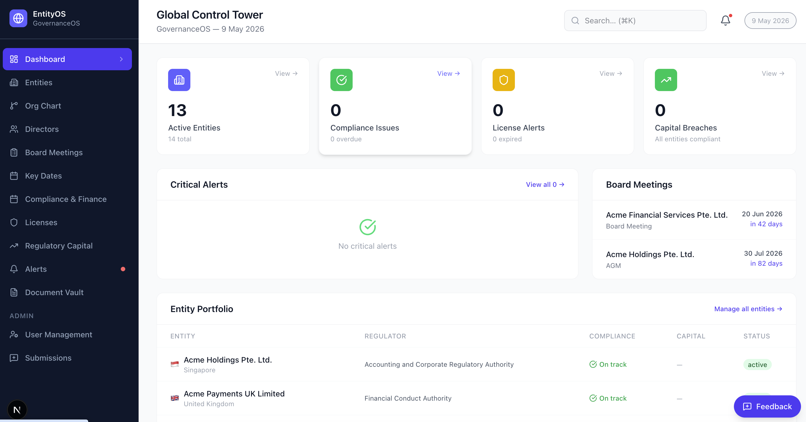
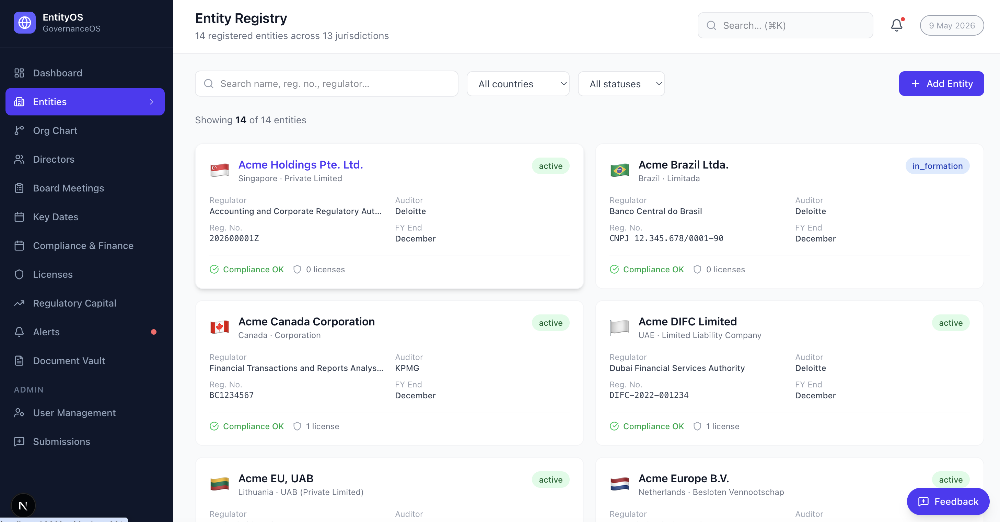

# GovernanceOS

**Open-source corporate entity governance platform for regulated financial institutions.**

GovernanceOS centralises management of legal entities, directors, board meetings, regulatory compliance, licenses, and capital requirements across a global portfolio — with built-in AI tools for board governance document generation.

> Built with Next.js 15, TypeScript, PostgreSQL, and Prisma 7.

---

## Screenshots

| Dashboard | Entity Registry |
|---|---|
|  |  |

| Board Meetings | Terms of Reference Generator |
|---|---|
|  |  |

> **To regenerate screenshots:** Open each HTML file in `public/screenshots/` in Chrome, open DevTools (F12) → Console → run `document.body.style.zoom='1'`, then use the three-dot menu → **Capture full size screenshot**. Save as a PNG with the corresponding filename above.

---

## Features

- **Entity Registry** — legal structure, registration numbers, incorporaton dates, parent/subsidiary hierarchy, health scoring
- **Director Management** — appointment dates, terms, roles, nationality, tenure tracking, guide document links
- **Board Meetings** — agenda management, quorum tracking, attendance, resolutions, document uploads, ICS calendar export
- **Compliance Obligations** — due date tracking, regulator mapping, overdue alerts, owner assignment
- **License Management** — license types, expiry tracking, renewal alerts across jurisdictions
- **Regulatory Capital** — minimum capital requirements, current balances, buffer health monitoring
- **Alerts Centre** — critical, warning, and informational alerts surfaced on the dashboard
- **AI Board Terms of Reference Generator** — generates a jurisdiction-aware Word (.docx) document from statutory templates for 10 countries; Stage 2 uses Claude AI to extract clauses from uploaded Constitution and SHA documents
- **Jira Integration** — bidirectional sync of compliance obligations
- **Slack Integration** — webhook-based alerts to your compliance channel
- **Audit Trail** — append-only log of all mutations across all models
- **Interactive Org Chart** — visual corporate structure tree
- **Key Dates Calendar** — compliance deadlines and meeting schedule in one view

---

## Supported Jurisdictions (Terms of Reference)

Singapore · United Kingdom · Malta · Lithuania · Australia · India · Netherlands · Malaysia · Hong Kong · UAE

---

## Tech Stack

| Layer | Technology |
|---|---|
| Framework | Next.js 15 (App Router) |
| Language | TypeScript 5 |
| Database | PostgreSQL 14+ |
| ORM | Prisma 7 (`@prisma/adapter-pg`) |
| Auth | NextAuth v4 (Okta OIDC, disabled by default) |
| UI | Radix UI · Tailwind CSS v4 · Lucide React |
| Charts | Recharts |
| AI | Anthropic Claude API (Terms of Reference Stage 2) |
| Document Generation | docx.js |

---

## Getting Started

### Prerequisites

- Node.js 20+
- PostgreSQL 14+ (local or hosted — [Supabase](https://supabase.com) works great)
- npm

### Setup

```bash
# 1. Clone the repo
git clone https://github.com/YOUR_USERNAME/governance-os.git
cd governance-os

# 2. Install dependencies
npm install

# 3. Copy environment template
cp .env.example .env
# Edit .env and set DATABASE_URL to your PostgreSQL connection string

# 4. Run database migrations
npm run db:migrate

# 5. Seed demo data (entities, directors, meetings, compliance, licenses)
npm run db:seed

# 6. Start the development server
npm run dev
```

Open [http://localhost:3000](http://localhost:3000).

Authentication is **disabled by default** — you'll be signed in automatically as a super_admin. No Okta setup needed for local development.

---

## Environment Variables

| Variable | Required | Description |
|---|---|---|
| `DATABASE_URL` | **Yes** | PostgreSQL connection string |
| `AUTH_ENABLED` | No | Set `true` to enable Okta SSO. Default: `false` |
| `ANTHROPIC_API_KEY` | No | Required only for Terms of Reference Stage 2 AI analysis |
| `NEXTAUTH_SECRET` | If auth enabled | Random secret — generate with `openssl rand -base64 32` |
| `NEXTAUTH_URL` | If auth enabled | App base URL, e.g. `http://localhost:3000` |
| `OKTA_CLIENT_ID` | If auth enabled | Okta application client ID |
| `OKTA_CLIENT_SECRET` | If auth enabled | Okta application client secret |
| `OKTA_ISSUER` | If auth enabled | Okta issuer URL |
| `SLACK_WEBHOOK_URL` | No | Slack incoming webhook for compliance alerts |
| `JIRA_BASE_URL` | No | Jira Cloud base URL for compliance sync |
| `JIRA_EMAIL` | No | Jira service account email |
| `JIRA_API_TOKEN` | No | Jira API token |
| `JIRA_PROJECT_KEY` | No | Jira project key to sync with |

---

## Project Structure

```
governance-os/
├── app/                        # Next.js App Router pages and API routes
│   ├── dashboard/              # KPI dashboard and portfolio overview
│   ├── entities/               # Entity registry list and detail pages
│   │   └── [id]/
│   │       └── tor/            # Board Terms of Reference generator
│   ├── directors/              # Director registry
│   ├── board-meetings/         # Meeting list, detail, and new meeting form
│   ├── compliance/             # Compliance obligations tracker
│   ├── licenses/               # License registry
│   ├── capital/                # Regulatory capital positions
│   ├── alerts/                 # Alert centre
│   ├── documents/              # Document library
│   ├── calendar/               # Key dates calendar view
│   ├── org-chart/              # Interactive corporate structure chart
│   └── api/                    # REST API handlers
│
├── components/
│   ├── layout/                 # Sidebar, Header
│   ├── entities/               # AddEntityModal, EntityEditModal
│   └── ui/                     # Shared Modal, FormField components
│
├── lib/
│   ├── tor/
│   │   └── jurisdictions.ts    # Statutory templates for 10 jurisdictions
│   ├── prisma.ts               # Prisma singleton (PrismaPg adapter)
│   ├── audit.ts                # writeAuditLog() helper
│   └── utils.ts                # formatDate, formatCurrency, flag emojis, etc.
│
└── prisma/
    ├── schema.prisma           # 14 models, 10 enums
    └── seed.ts                 # Idempotent demo data seed
```

---

## Database Schema

14 models: `Entity`, `Director`, `BoardMeeting`, `MeetingAttendee`, `MeetingDocument`, `MeetingResolution`, `ComplianceObligation`, `License`, `RegulatoryCapital`, `BankAccount`, `Alert`, `Document`, `AuditLog`, `User`

Run `npm run db:studio` to open Prisma Studio and browse the schema visually.

---

## User Roles

| Role | Access |
|---|---|
| `super_admin` | Everything including User management |
| `admin` | All modules except User management |
| `legal` | Entities, Directors, Meetings, Compliance, Licenses, Documents |
| `finance` | Entities, Capital, Alerts |
| `viewer` | Dashboard and Entities (read-only) |

---

## Terms of Reference Generator

Navigate to any entity → click **Terms of Reference**.

**Stage 1 — Template-based (no AI required)**
- Pre-fills quorum, notice period, and reserved matters from the jurisdiction's Companies Act defaults
- Generates a fully formatted Word document (.docx) with cover page, board composition table, meeting rules, statutory compliance clauses, reserved matters, and signature block

**Stage 2 — AI-assisted (requires `ANTHROPIC_API_KEY`)**
- Upload your company Constitution and/or Shareholder Agreement (PDF or DOCX)
- Claude AI extracts relevant governance clauses, identifies quorum/notice overrides, and flags conflicts between documents
- All findings are merged into the generated Word document with dedicated sections

---

## Jira Integration

To sync compliance obligations from Jira:

1. Set `JIRA_BASE_URL`, `JIRA_EMAIL`, `JIRA_API_TOKEN`, and `JIRA_PROJECT_KEY` in `.env`
2. Edit `lib/jiraEntityMap.ts` to map your Jira entity name patterns to GovernanceOS entity IDs
3. The sync endpoint is `/api/webhooks/jira` — configure a Jira automation to POST to it

---

## Contributing

Pull requests are welcome. For major changes, please open an issue first to discuss what you'd like to change.

1. Fork the repo
2. Create a feature branch (`git checkout -b feat/your-feature`)
3. Commit your changes
4. Push and open a pull request

---

## License

MIT

---

## Acknowledgements

Built to solve real corporate governance pain at scale. Designed for compliance and legal teams managing regulated financial institutions across multiple jurisdictions.
